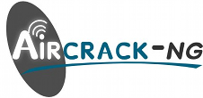

<!--  -->


# Aircrack-ng Tutorial

Learn how to use Aircrack-ng, a powerful suite for WiFi security analysis, to understand and test wireless network security protocols.

<br>

### **Table of Contents**

- [Overview](#overview)
- [Objectives](#objectives)
- [Prerequisites](#prerequisites)
- [Steps](#steps)
  - [Installation](#installation)
  - [Basic Concepts](#basic-concepts)
  - [Capturing Packets](#capturing-packets)
  - [Cracking WEP](#cracking-wep)
  - [Cracking WPA/WPA2](#cracking-wpawpa2)
- [Advanced Techniques](#advanced-techniques)
  - [Deauthenticating Clients](#deauthenticating-clients)
  - [Creating a Wordlist](#creating-a-wordlist)
- [Best Practices and Tips](#best-practices-and-tips)
- [Resources](#resources)
- [Contribution](#contribution)

<br>

## **Overview**

Aircrack-ng is a network software suite that includes tools for packet sniffing, WEP/WPA key cracking, and WiFi network analysis. It captures network packets and attempts to crack the network password, making it invaluable for WiFi security testing.

<br>

## **Objectives**

By the end of this tutorial, you will:

- Understand the purpose and capabilities of Aircrack-ng.
- Learn to capture network packets and perform basic WiFi security analysis.
- Practice ethical usage of Aircrack-ng tools.

<br>

## **Prerequisites**

- **Hardware**: A wireless network adapter capable of packet injection and monitor mode.
- **Software**:
  - **Linux**: Install Aircrack-ng via package manager (`sudo apt-get install aircrack-ng`).
  - **Windows**: Limited functionality available.
  - **macOS**: Install using tools like MacPorts or Brew.
- **Legal Considerations**: Only use Aircrack-ng on networks you own or have explicit permission to test.

<br>

## **Steps**

<br>

### **Installation**

Follow these steps to install Aircrack-ng:

- **Linux**:

  ```bash
  sudo apt-get install aircrack-ng
  ```

- **Windows**: Download the [Windows version](https://www.aircrack-ng.org/) and install it.
- **macOS**: Use Brew:

  ```bash
  brew install aircrack-ng
  ```

<br>

### **Basic Concepts**

<br>

#### Understanding WiFi Security

- WiFi networks use security protocols like WEP, WPA, and WPA2.
- Aircrack-ng tests the robustness of these protocols by analyzing captured packets.

#### Required Hardware

- Ensure your network adapter supports **packet injection** and **monitor mode**.

<br>

### **Capturing Packets**

1. Start capturing packets using `airodump-ng`:

   ```bash
   airodump-ng wlan0
   ```

2. Identify the target network’s:
   - **BSSID**
   - **Channel**
   - **ESSID**

3. Focus on a specific network:

   ```bash
   airodump-ng --bssid [target BSSID] -c [channel] --write [output file] wlan0
   ```

<br>

### **Cracking WEP**

1. Capture enough data packets from the target network.
2. Use Aircrack-ng to crack the WEP key:

   ```bash
   aircrack-ng [output file]-01.cap
   ```

<br>

### **Cracking WPA/WPA2**

1. Capture a WPA handshake:
   - Deauthenticate a client if needed (see [Deauthenticating Clients](#deauthenticating-clients)).
2. Use a wordlist to attempt cracking the key:

   ```bash
   aircrack-ng -w [wordlist file] [output file]-01.cap
   ```

<br>

## **Advanced Techniques**

### **Deauthenticating Clients**

To capture a handshake for WPA/WPA2 cracking, force a client to reconnect:

  ```bash
  aireplay-ng --deauth 0 -a [target BSSID] -c [client BSSID] wlan0
  ```

<br>

### **Creating a Wordlist**

Generate a custom wordlist using tools like `crunch`:

  ```bash
  crunch [min-length] [max-length] [charset] -o [output file]
  ```

Example:

  ```bash
  crunch 8 12 abcdef123 > wordlist.txt
  ```

<br>

## **Best Practices and Tips**

- **Stay Legal**: Only use Aircrack-ng on authorized networks.
- **Hardware Compatibility**: Confirm your adapter supports necessary features.
- **Ethical Usage**: Use Aircrack-ng to improve the security of your own networks.
- **Password Strength**: Promote strong, complex passwords for improved network security.

<br>

## **Resources**

- [Aircrack-ng Official Documentation](https://www.aircrack-ng.org/doku.php)
- [WiFi Security Basics](https://en.wikipedia.org/wiki/Wireless_security)
- [Installing Drivers for Wireless Adapters](https://www.aircrack-ng.org/doku.php?id=compatibility_drivers)

<br>

## **Contribution**

Your contributions can make these scripts even better:

- Fork the repository.

- Create a new branch:

  ```bash
  git checkout -b my-awesome-feature
  ```

- Make your invaluable changes.

- Commit your changes:

  ```bash
  git commit -am 'Added some amazing features'
  ```

- Push to the branch:

  ```bash
  git push origin my-awesome-feature
  ```

- Create a new Pull Request targeting the Notes directory.

Contributions are welcome! Feel free to open issues, suggest enhancements, or submit pull requests to improve the script.

<br>

## **Author**

- **Raphael Chookagian** | [GitHub Profile](https://github.com/cesar-group)

## **Date of Latest Revision**

- 12/10/2024

## **License**

- This script is provided as-is without any warranties. Users are advised to review and understand the script before executing it.

- This project is licensed under the MIT License. See the LICENSE file for details.
