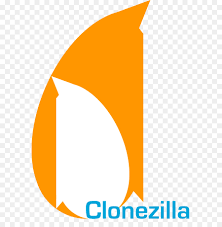

# Clonezilla

Clonezilla is a free, open-source disk imaging and cloning tool. It can be used to create a complete snapshot of your entire hard drive, including the operating system, installed programs, settings, and files.

<br>

### **Table of Contents**

- [Overview](#overview)
- [Objectives](#objectives)
- [Prerequisites](#prerequisites)
- [Steps](#steps)
  - [Step 1: Create a Bootable Clonezilla USB](#step-1-create-a-bootable-clonezilla-usb)
  - [Step 2: Prepare Your Computer](#step-2-prepare-your-computer)
  - [Step 3: Using Clonezilla to Create the Image](#step-3-using-clonezilla-to-create-the-image)
  - [Step 4: Start the Imaging Process](#step-4-start-the-imaging-process)
  - [Step 5: Completing the Process](#step-5-completing-the-process)
- [Tips and Best Practices](#tips-and-best-practices)
- [Troubleshooting](#troubleshooting)
- [Resources](#resources)
- [Contribution](#contribution)

<br>

## **Overview**

Clonezilla is a powerful disk cloning tool that allows users to create an exact image of their hard drive, which can be used for backups or system restoration. This tutorial covers the steps required to use Clonezilla effectively.

<br>

## **Objectives**

By the end of this tutorial, you will:

- Understand the steps to create a bootable Clonezilla USB drive.
- Learn how to prepare your system and use Clonezilla for disk imaging.
- Troubleshoot common issues and follow best practices for using Clonezilla.

<br>

## **Prerequisites**

- A USB drive with at least 4GB of space to create a bootable Clonezilla drive.
- An external hard drive or network location to save the image.
- A computer running Windows or Linux.

<br>

## **Steps**

### **Step 1: Create a Bootable Clonezilla USB**

1. **Download Clonezilla**: Visit the Clonezilla website and download the ISO file for Clonezilla Live.
2. **Create Bootable USB**: Use a tool like Rufus or balenaEtcher to create a bootable USB drive with the Clonezilla ISO:
   - Launch the tool, select the Clonezilla ISO, and choose your USB drive as the destination.
   - Start the process and wait until it's completed.

<br>

### **Step 2: Prepare Your Computer**

1. **Backup Important Data**: Always back up important files separately as an extra precaution.
2. **Connect External Drive**: Connect the external hard drive or ensure network connectivity for storing the image.
3. **Restart Computer with USB**: Restart your computer and boot from the Clonezilla USB drive. This might require entering the BIOS or UEFI settings to change the boot order.

<br>

### **Step 3: Using Clonezilla to Create the Image**

1. **Boot into Clonezilla**: Choose “Clonezilla Live (Default settings)” from the boot menu.
2. **Language and Keyboard**: Select your preferred language and keyboard layout.
3. **Start Clonezilla**: Choose “Start Clonezilla” to enter the disk cloning process.
4. **Select Mode**: Choose “device-image” to create an image of your hard drive.
5. **Choose Image Repository**: Select where to save the image (local drive, SSH server, Samba server, etc.).
6. **Select Source Disk**: Choose the hard drive you want to image.
7. **Image Naming and Options**:
   - Name your image for easy identification.
   - Choose compression options (if needed).
   - Select any advanced parameters (for expert users).

<br>

### **Step 4: Start the Imaging Process**

1. **Confirm and Begin**: Review your selections and confirm to start the imaging process.
2. **Monitor the Process**: Clonezilla will show progress. This can take time depending on the size of your hard drive and the speed of your computer and storage media.

<br>

### **Step 5: Completing the Process**

1. **Completion**: Once done, you will receive a message stating the process is complete.
2. **Shutdown or Reboot**: Safely shutdown or reboot your computer.
3. **Remove USB Drive**: Remove the Clonezilla USB drive after shutting down.

<br>

## **Tips and Best Practices**

- **Verify Image**: After creating the image, it’s a good practice to verify its integrity to ensure the backup was successful.
- **Regular Imaging**: Regularly image your drive to keep the backup updated.
- **Safe Storage**: Store the external hard drive in a safe, dry place to avoid physical damage.
- **Documentation**: Keep a record of when the image was created and its contents for easy reference.

<br>

## **Troubleshooting**

- **Boot Issues**: If you have trouble booting from the USB, check your BIOS/UEFI settings and ensure the USB is set as the first boot device.
- **Storage Space**: Ensure your external drive has enough space for the image file.
- **Compatibility**: Some newer hardware might have compatibility issues with Clonezilla. Check the Clonezilla website for the latest version and support information.

<br>

## **Resources**

- [Clonezilla Official Website](https://clonezilla.org)
- [Clonezilla Documentation](https://clonezilla.org/clonezilla-live-doc.php)

<br>

## **Contribution**

Your contributions can make this guide even better:

- Fork the repository.
- Create a new branch:

  ```bash
  git checkout -b my-awesome-feature
  ```

- Make your invaluable changes.
- Commit your changes:

  ```bash
  git commit -am 'Added some amazing features'
  ```

- Push to the branch:

  ```bash
  git push origin my-awesome-feature
  ```

- Create a new Pull Request targeting the `Notes` directory.

Contributions are welcome! Feel free to open issues, suggest enhancements, or submit pull requests to improve the script.

<br>

## **Author**

- **Raphael Chookagian** | [GitHub Profile](https://github.com/cesar-group)

## **Date of Latest Revision**

- 12/10/2024

## **License**

- This guide is provided as-is without any warranties. Users are advised to review and understand the guide before executing any commands.

- This project is licensed under the MIT License. See the LICENSE file for details.
