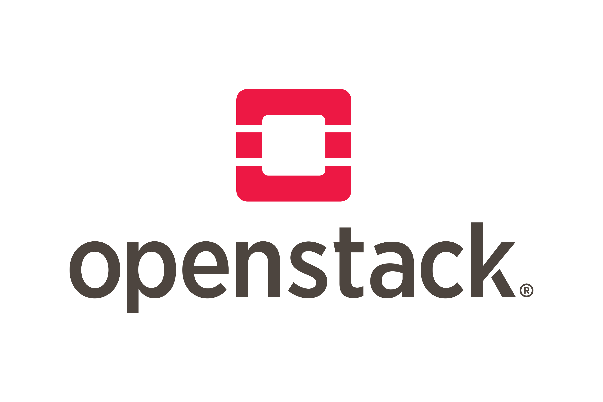

# OpenStack: Comprehensive Guide and Tutorial

Learn the fundamentals of OpenStack, its components, setup, and management effectively.

<br>

### **Table of Contents**

- [Overview](#overview)
- [Objectives](#objectives)
- [Prerequisites](#prerequisites)
- [Steps](#steps)
  - [Understanding OpenStack](#understanding-openstack)
  - [Setting Up OpenStack](#setting-up-openstack)
  - [Managing OpenStack](#managing-openstack)
  - [Security Best Practices](#security-best-practices)
- [Best Practices](#best-practices)
- [Notes](#notes)
- [Resources](#resources)
- [Contribution](#contribution)

<br>

## **Overview**

OpenStack is an open-source cloud computing platform that manages large pools of compute, storage, and networking resources throughout a datacenter. It is controlled through a dashboard (Horizon) that gives administrators control while empowering users to provision resources through a web interface.

<br>

## **Objectives**

By the end of this tutorial, you will:

- Understand the core components of OpenStack and their roles.
- Learn how to set up and manage an OpenStack environment.
- Be able to perform basic operations and ensure security best practices.

<br>

## **Prerequisites**

To follow this tutorial, you should:

- Have a basic understanding of cloud computing concepts.
- Have access to hardware or virtual environments that meet OpenStack requirements.
- Be familiar with Linux and networking fundamentals.

<br>

## **Steps**

### **Understanding OpenStack**

#### What is OpenStack?

OpenStack is a set of software tools for building and managing cloud computing platforms for public and private clouds. It is often considered the Linux of the cloud and is backed by a vibrant community of developers.

#### Core Components of OpenStack

1. **Nova**: Compute service for managing instances.
2. **Swift**: Object storage system.
3. **Cinder**: Block storage system.
4. **Neutron**: Networking service.
5. **Horizon**: Dashboard for OpenStack services.
6. **Keystone**: Identity service for authentication.
7. **Glance**: Image service.
8. **Heat**: Orchestration service for infrastructure as code.

<br>

### **Setting Up OpenStack**

#### Preparing the Environment

| Step                           | Description                                                                 | Example                                     |
|--------------------------------|-----------------------------------------------------------------------------|---------------------------------------------|
| Ensure hardware requirements   | CPUs with virtualization support, sufficient memory, and storage.          | N/A                                         |
| Plan network architecture      | Decide on a network topology and IP addressing scheme.                     | N/A                                         |

#### Installation

| Method                         | Description                                                                 | Example                                     |
|--------------------------------|-----------------------------------------------------------------------------|---------------------------------------------|
| Packaged OpenStack             | Pre-packaged versions for production use.                                  | Follow the official installation guide.     |
| OpenStack-Ansible              | Automated deployment using Ansible scripts.                                | `git clone https://github.com/openstack/openstack-ansible.git` |
| DevStack                       | Lightweight version for testing and development.                           | `git clone https://github.com/openstack-dev/devstack.git` |

#### Post-Installation

| Step                           | Description                                                                 | Example                                     |
|--------------------------------|-----------------------------------------------------------------------------|---------------------------------------------|
| Configure initial settings     | Set up networks, flavors, and images in Glance.                            | `openstack flavor create m1.small`         |
| Set up users and projects      | Define roles and permissions in Keystone.                                  | `openstack user create --project demo --password pass` |

<br>

### **Managing OpenStack**

#### Daily Operations

| Task                           | Description                                                                 | Example                                     |
|--------------------------------|-----------------------------------------------------------------------------|---------------------------------------------|
| Monitor services               | Use Horizon dashboard or CLI tools to monitor health.                      | `openstack service list`                   |
| Perform regular backups        | Back up critical data and configurations.                                  | `tar -czvf openstack_backup.tar.gz /etc/openstack` |

#### Advanced Topics

| Topic                          | Description                                                                 | Example                                     |
|--------------------------------|-----------------------------------------------------------------------------|---------------------------------------------|
| Scaling                        | Add more nodes or services to scale up the environment.                    | `openstack compute service list`           |
| High Availability              | Configure failover and load balancing.                                     | Use Pacemaker or HAProxy.                  |
| Troubleshooting                | Use logs and monitoring tools to resolve issues.                           | `journalctl -u openstack-nova-compute`     |

<br>

### **Security Best Practices**

| Practice                       | Description                                                                 | Example                                     |
|--------------------------------|-----------------------------------------------------------------------------|---------------------------------------------|
| Regular updates                | Keep OpenStack components up to date.                                      | `apt update && apt upgrade` (for Ubuntu)   |
| Robust firewall rules          | Define rules to secure network access.                                     | Use iptables or security groups.           |
| Strong authentication          | Use Keystone for role-based access control.                                | `openstack role add --user admin --project demo` |

<br>

## **Best Practices**

- **Automation**: Use tools like Heat for orchestration and automation of cloud resources.
- **Network Optimization**: Design an efficient network topology and use Neutron for advanced networking features.
- **Resource Management**: Use Ceilometer and other monitoring tools for resource tracking and optimization.
- **Hybrid Cloud Strategies**: Integrate OpenStack with other public cloud providers for hybrid cloud scenarios.

<br>

## **Notes**

- **Pro Tip**: Regularly review logs and monitor usage to optimize performance.
- **Warning**: Misconfigurations can lead to service outages. Ensure thorough testing.

<br>

## **Resources**

- [OpenStack Documentation](https://docs.openstack.org/)
- [OpenStack Community](https://www.openstack.org/community/)
- [OpenStack Ansible](https://docs.openstack.org/project-deploy-guide/openstack-ansible/latest/)

<br>

## **Contribution**

Your contributions are highly encouraged to enhance this guide:

- Fork the repository.
- Create a new branch:

    ```bash
    git checkout -b my-awesome-feature
    ```

- Make your valuable changes.
- Commit your changes:

    ```bash
    git commit -am 'Added some amazing features'
    ```

- Push to the branch:

    ```bash
    git push origin my-awesome-feature
    ```

- Create a new Pull Request targeting the `Notes` directory.

Contributions are welcome! Feel free to open issues, suggest enhancements, or submit pull requests to improve this guide.

<br>

## **Author**

- **Raphael Chookagian** | [GitHub Profile](https://github.com/cesar-group)

## **Date of Latest Revision**

- 12/10/2024

## **License**

- This guide is provided as-is without any warranties. Users are advised to review and understand the guide before executing any commands.

- This project is licensed under the MIT License. See the LICENSE file for details.
