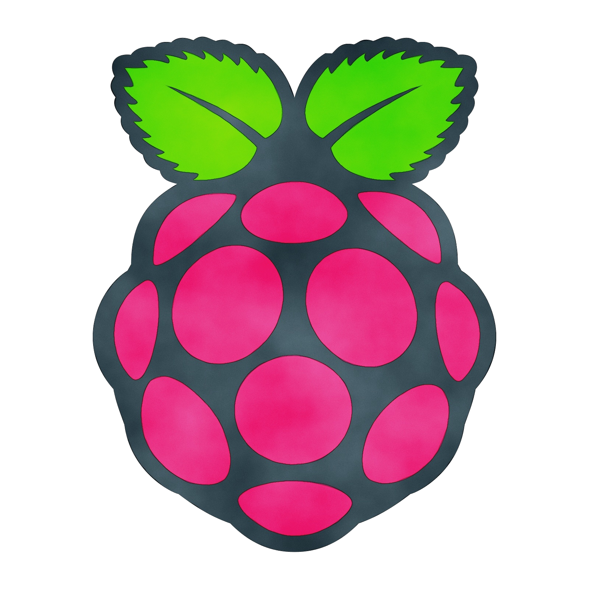

# Creating a Complete Backup Image of Your Raspberry Pi SD Card

Learn how to create a full backup image of your Raspberry Pi's SD card for recovery or cloning purposes.

<br>

### **Table of Contents**

- [Overview](#overview)
- [Prerequisites](#prerequisites)
- [Step-by-Step Guide](#step-by-step-guide)
  - [Preparing the External Hard Drive](#preparing-the-external-hard-drive)
  - [Creating the Image](#creating-the-image)
  - [Post-Creation](#post-creation)
- [Safety and Notes](#safety-and-notes)
- [Conclusion](#conclusion)
- [Contribution](#contribution)

<br>

## **Overview**

Creating a full backup image of your Raspberry Pi's SD card is essential for easy recovery or cloning of your setup. This tutorial guides you through the process of creating an image file of your Raspberry Pi's SD card and storing it on an external hard drive. This image can be used to restore your setup on another SD card or keep as a backup.

<br>

## **Prerequisites**

- **Raspberry Pi**: A Raspberry Pi running Ubuntu or a similar OS.
- **External Hard Drive**: An external hard drive with sufficient storage space.
- **Basic Terminal Knowledge**: Basic familiarity with terminal commands.

<br>

## **Step-by-Step Guide**

### **Preparing the External Hard Drive**

1. **Mount the External Hard Drive**:
   - Connect your external hard drive to the Raspberry Pi.
   - Open the terminal and run `lsblk` or `df -h` to check if the drive is mounted.
   - If not mounted, create a mount point and mount the drive:

     ```bash
     sudo mkdir /media/pi/MyExternalDrive
     sudo mount /dev/sda1 /media/pi/MyExternalDrive
     ```

     Replace `/dev/sda1` with your drive's identifier as shown in `lsblk`.

2. **Navigate to the Mounted Drive**:
   - Change directory to the mount point:

     ```bash
     cd /media/pi/MyExternalDrive
     ```

<br>

### **Creating the Image**

3. **Identify the SD Card Device**:
   - In the terminal, run `lsblk` to identify your SD card device. It's usually labeled as `/dev/mmcblk0`.

4. **Create the Image with `dd` Command**:

   ```bash
   sudo dd if=/dev/mmcblk0 of=./raspberry_pi_backup.img bs=4M status=progress
   ```

   - `if=/dev/mmcblk0` specifies the SD card as the input.
   - `of=./raspberry_pi_backup.img` specifies the output image file.
   - `bs=4M` sets the block size to 4MB for efficient copying.
   - `status=progress` displays the progress.

<br>

### **Post-Creation**

5. **Safely Eject the Hard Drive**:

   - After the backup is complete, unmount the drive:

     ```bash
     sync
     sudo umount /media/pi/MyExternalDrive
     ```

6. **Restoring or Cloning**:
   - To restore the image to another SD card, use:

     ```bash
     sudo dd if=./raspberry_pi_backup.img of=/dev/sdX bs=4M status=progress
     ```

   - Replace `/dev/sdX` with your new SD card's device name.
   - Alternatively, use software like BalenaEtcher for a GUI approach.

<br>

## **Safety and Notes**

- Double-check the device names (`/dev/mmcblk0`, `/dev/sdX`) to avoid data loss.
- The `dd` command requires caution. Incorrect usage can result in data loss.
- The backup file size will be equal to your SD card’s total capacity.
- Ensure enough space on your external hard drive.
- Consider using graphical tools for a more user-friendly experience.

<br>

## **Conclusion**

By following this tutorial, you have created a complete image of your Raspberry Pi's SD card. This image is crucial for backup purposes and can be used to quickly restore or clone your Raspberry Pi setup onto another SD card. Always handle the `dd` command with care and verify device names before proceeding.

<br>

## **Contribution**

Your contributions are highly encouraged to enhance this guide:

- Fork the repository.
- Create a new branch:

    ```bash
    git checkout -b my-awesome-feature
    ```

- Make your valuable changes.
- Commit your changes:

    ```bash
    git commit -am 'Added some amazing features'
    ```

- Push to the branch:

    ```bash
    git push origin my-awesome-feature
    ```

- Create a new Pull Request targeting the `Notes` directory.

Contributions are welcome! Feel free to open issues, suggest enhancements, or submit pull requests to improve this guide.

<br>

## **Author**

- **Raphael Chookagian** | [GitHub Profile](https://github.com/cesar-group)

## **Date of Latest Revision**

- 12/10/2024

## **License**

- This guide is provided as-is without any warranties. Users are advised to review and understand the guide before executing any commands.

- This project is licensed under the MIT License. See the LICENSE file for details.
